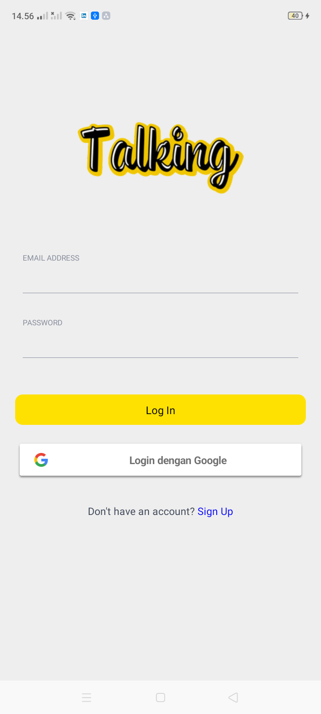

<h1 align='center'>Talking  React Native Chat Apps with Maps</h1>

    

 
 

## Introduction

Talking is a chat application with the map feature for track / show location user's friends near the location current user. Talking Chat built using a base real time data and the database used is Firebase.

## Requirements

1. <a href="https://nodejs.org/en/download/">Node Js</a>
2. Node_modules `npm install` or `yarn install`

## How to Install

1. Download this Project or you can type `https://github.com/fikribasa/BasaChat.git`
2. Open app's directory in CMD or Terminal
3. Type `npm install` or `yarn install`
4. Type `react-native run-android`

## Download the APK

You can Download the APK [`here`](https://drive.google.com/file/d/1Jrr2H2cRCS_xgmhZg_CV3m0GG3qOTC14/view?usp=sharing)

## Screenshot from the App

  
      <image width="200" src='./Global/Asset/Image/tlk1.png' />
      <image width="200" src='./Global/Asset/Image/tlk2.png' />
      <image width="200" src='./Global/Asset/Image/tlk3.png' />
     
      
  

  
      <image width="200" src='./Global/Asset/Image/tlk4.png' />
        <image width="200" src='./Global/Asset/Image/tlk5.png' />
      <image width="200" src='./Global/Asset/Image/tlk6.png' />
      
  

  
      <image width="200" src="./screenshoot/friendprofile.jpg" />
      <image width="200" src="./screenshoot/profile.jpg" />      
  

